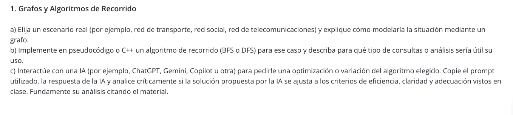
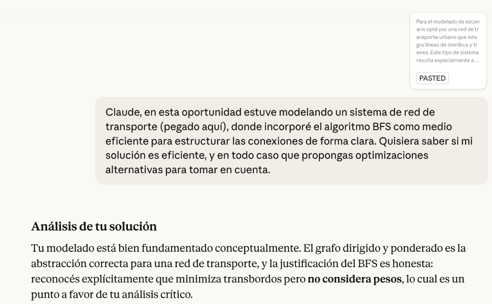
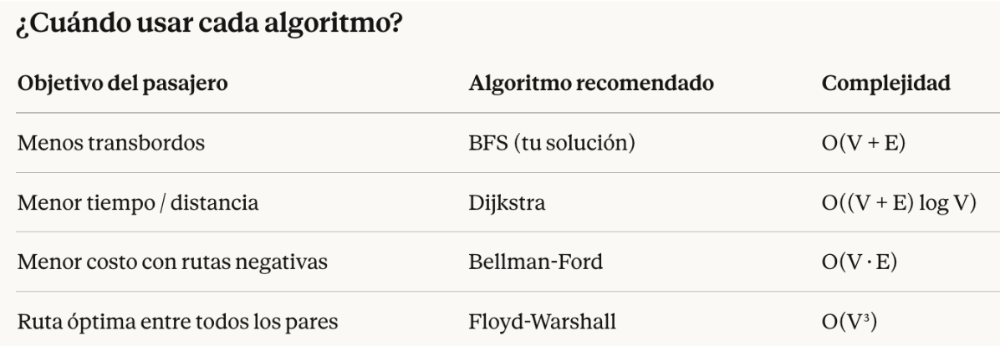

a) Para el modelado de escenario opté por una red de transporte urbano que integra líneas de ómnibus y trenes. Este tipo de sistema resulta especialmente apropiado para ser representado mediante un grafo, ya que está compuesto por puntos físicos (estaciones y paradas) interconectados por rutas con características medibles.
En el modelo, los nodos o vértices representan las estaciones de tren, las paradas de ómnibus y las terminales centrales, es decir, todos los puntos donde un pasajero puede iniciar, finalizar o transbordar un viaje. Las aristas o arcos, por su parte, representan las rutas de transporte que conectan esos puntos entre sí.
El grafo se define como dirigido y ponderado. Es dirigido porque ciertas calles o vías son de sentido único, por lo que la conexión entre dos nodos no siempre es recíproca. Es ponderado porque cada arista lleva un peso que puede expresar el tiempo de viaje, la distancia en kilómetros o el costo del pasaje, según el tipo de análisis que se quiera realizar. Este modelo permite estudiar la conectividad de la red y sentar las bases para optimizar recorridos tanto para pasajeros como para la planificación operativa del sistema.

b) Elección del algoritmo: BFS
Para recorrer esta red se utiliza el algoritmo BFS (Breadth-First Search), que explora el grafo de forma profunda nivel por nivel: primero todas las estaciones accesibles con un viaje directo desde el origen, luego las que requieren exactamente un transbordo, y así sucesivamente. Esta característica lo vuelve adecuado para encontrar la ruta con menor cantidad de transbordos entre dos puntos de la red. Si bien BFS refleja el mínimo de transbordos, no considera los pesos de las aristas, y el cálculo no involucra a las variables “menor tiempo” o “menor costo”. Para optimizar recorridos en función de esos valores se podría implementar el algoritmo de Dijkstra, que sí opera sobre grafos ponderados.

(VER CÓDIGO)
Funcionamiento del recorrido

El algoritmo comienza marcando la estación de origen como visitada y colocándola en una cola FIFO. A partir de ahí, en cada iteración extrae el nodo al frente de la cola, lo procesa e incorpora a la cola todos sus vecinos que aún no hayan sido visitados, marcándolos como visitados en ese mismo momento para evitar duplicados. El ciclo continúa hasta que la cola queda vacía, lo que indica que todas las estaciones alcanzables desde el origen ya fueron exploradas.

Las tres estructuras que sostienen esta lógica son el vector<int>> grafo, que almacena la red como lista de adyacencia; el vector<bool> visitado, que registra qué estaciones ya fueron procesadas; y la queue<int> cola, que garantiza el orden de exploración por niveles. La combinación de estas tres estructuras asegura que el recorrido sea completo, sin repeticiones y ordenado por cercanía al origen. 
El BFS aplicado a esta red de transporte permite responder varios tipos de preguntas relevantes tanto para usuarios como para operadores del sistema. En primer lugar, establece si existe alguna ruta entre dos estaciones cualesquiera, lo que equivale a verificar la conectividad del grafo. En segundo lugar, encuentra la ruta con menor cantidad de transbordos entre el origen y cualquier destino, lo cual es útil para un pasajero que prioriza la simplicidad del viaje (optimizar tramos) sobre otros factores. También permite identificar qué estaciones son alcanzables desde un punto de partida en a lo sumo un número determinado de conexiones, o detectar cuál es la estación más alejada en términos de transbordos desde cualquier nodo. Finalmente, al garantizar que cada nodo se visita una sola vez, el algoritmo evita ciclos y es eficiente incluso en redes de gran tamaño.

c) Para este punto copié mi elaboración previa y lo consulté con Claude de la siguiente manera:

La IA Claude, me devolvió una perspectiva de mi análisis. y a continuación sugirió:

Optimización 1 — BFS con reconstrucción de camino
La mejora más inmediata sobre tu código: agregar un vector padre[] para poder trazar el recorrido completo.
Optimización 2 — Dijkstra para minimizar tiempo o costo
Cuando los pesos importan (tiempo, distancia, tarifa), BFS ya no es suficiente. Dijkstra es la extensión natural y mantiene una estructura similar.

Con lo antedicho concluye:

Análisis crítico de las sugerencias de la IA:
Si bien es cierto que las optimizaciones son adecuadas al planteo, toda situación modelada toma en cuenta un recorte de variables prioritarias. En mi caso, la decisión de usar BFS no fue una omisión sino una elección deliberada, donde el objetivo central del modelo era representar la conectividad de la red y minimizar transbordos, no optimizar tiempos ni costos. Desde esa perspectiva, BFS es suficiente y apropiado.
La sugerencia de incorporar Dijkstra es pertinente para una segunda etapa del sistema, pero introduce una complejidad mayor —tanto computacional como de implementación— que no se justifica si el usuario final sólo necesita saber cuántos transbordos implica su recorrido.
Sí se evidencia como mejora genuina la reconstrucción del camino mediante el vector padre[]. Es un cambio de bajo costo que agrega valor sin alterar la lógica central del algoritmo ni complejizar el modelo. Me inclinaría por esta última optimización en una revisión del código.
