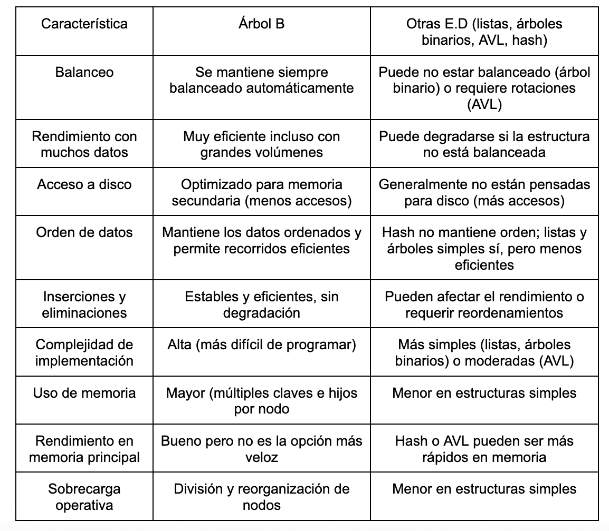

a) Un árbol B puede resultar útil cuando se trabaja con gestión de grandes volúmenes de datos, especialmente cuando los datos no están completamente en memoria (por ejemplo, discos duros.) Este tipo de árbol está diseñado para minimizar el número de accesos al disco, que se logra con el agrupamiento de múltiples claves en cada nodo y manteniendo una altura reducida. Con estas características, las búsquedas resultan rápidas y eficientes. Su aplicación es valiosa para distintos escenarios:
Bases de datos e índices: un motor de base de datos usa árboles B para indexar una columna (como DNI) y encontrar registros rápidamente. 
Datos ordenados: un sistema de ventas necesita listar productos por precio de menor a mayor de forma eficiente.
Muchos datos en disco: un sistema bancario guarda millones de cuentas en disco y usa un árbol B para acceder a cada cliente sin leer todo el archivo.
Muchas operaciones dinámicas: una app de reservas agrega y elimina turnos todo el tiempo sin que la estructura se vuelva lenta.
Búsquedas, inserciones y eliminaciones rápidas: una base de datos de usuarios permite agregar, eliminar y buscar perfiles constantemente sin perder rendimiento.

b) Para una implementación de un caso realista se propone un índice de productos en un sistema de inventario, donde se utiliza un árbol B para buscar rápidamente productos a partir de su código. En un comercio con gran cantidad de productos, las operaciones más frecuentes son la búsqueda de un producto por código, la inserción de nuevos productos y el mantenimiento de una organización automática cada vez que el inventario se modifica.
En el código propuesto, cada valor numérico representa el código de un producto, mientras que el árbol B cumple la función de índice. Esto permite realizar búsquedas de manera eficiente, incluso cuando la cantidad de datos crece considerablemente, ya que se evita recorrer todos los elementos.

La estructura se compone de nodos que pueden ser hojas o nodos internos. En los nodos hoja se insertan directamente los datos, mientras que en los nodos internos se decide a qué hijo descender en función del valor de la clave. De esta forma, el algoritmo guía tanto la búsqueda como la inserción de manera ordenada.
La inserción se realiza manteniendo el árbol balanceado en todo momento. Para ello, si un nodo aún tiene capacidad, se utiliza la función insertarNoLleno, que ubica el elemento en la posición correcta sin alterar la estructura. En cambio, cuando un nodo alcanza su capacidad máxima, se aplica la operación dividirHijo, que separa el nodo en dos y promueve la clave central al nodo padre. Este mecanismo evita la sobrecarga de los nodos y mantiene el orden de los datos.
La función insertar actúa como punto de control general, verificando si la raíz está llena. En ese caso, se genera una nueva raíz y se divide el nodo original, garantizando que el árbol crezca en altura de manera controlada.
Además, se implementa la función buscar, que permite localizar un producto recorriendo el árbol de forma eficiente, descendiendo por los nodos correspondientes según el valor buscado. También se incluye un recorrido que muestra los elementos en orden, evidenciando que la estructura mantiene los datos organizados. El árbol B se mantiene siempre balanceado, ya que todas sus hojas se encuentran al mismo nivel. Esta propiedad garantiza tiempos de acceso eficientes tanto para la búsqueda como para la inserción, lo que lo convierte en una estructura adecuada para sistemas que manejan grandes volúmenes de información, como bases de datos o sistemas de inventario.

c) Le pedí a la IA Claude que genere una tabla comparativa de árbol B con otras estructuras de datos: listas, árboles binarios, AVL, hash.

A modo de debate, considero que no existe una estructura que sea "mejor" en términos absolutos, sino que la elección depende del contexto de uso. Un árbol B ofrece ventajas en cuanto a balanceo automático y eficiencia en grandes volúmenes de datos, especialmente cuando estos se almacenan en disco, dado que se minimizan los accesos al almacenamiento secundario. Sin embargo, su mayor complejidad de implementación y consumo de memoria pueden resultar innecesarios en escenarios más simples. Es allí donde estructuras como tablas hash o árboles AVL pueden ofrecer un mejor rendimiento: las tablas hash sobresalen en búsquedas exactas de baja latencia, y los árboles AVL resultan preferibles cuando los datos caben en memoria principal y se requieren operaciones ordenadas con menor sobrecarga de implementación. Ambas alternativas, no obstante, sacrifican aspectos como la eficiencia en accesos a disco o la escalabilidad ante volúmenes masivos de datos.
Para inclinarnos por una estructura específica se deben identificar qué variable es prioritaria en el escenario concreto y elegir la estrategia de implementación que mejor se ajuste a ese contexto. En particular, vale preguntarse si el costo de implementar y mantener un árbol B —en términos de tiempo de desarrollo y complejidad operativa— justifica sus beneficios frente a estructuras más simples que pueden manejar la colección de datos con menor costo adicional.
En conclusión, los factores determinantes son el volumen de datos, si estos residen en memoria o en disco, la necesidad de mantenerlos ordenados, la frecuencia de inserciones y eliminaciones, y la complejidad que se está dispuesto a asumir en la implementación. La mejor estructura será, en definitiva, aquella que logre el equilibrio más adecuado entre eficiencia, simplicidad y los requerimientos concretos del sistema.
