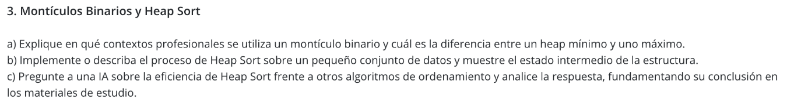
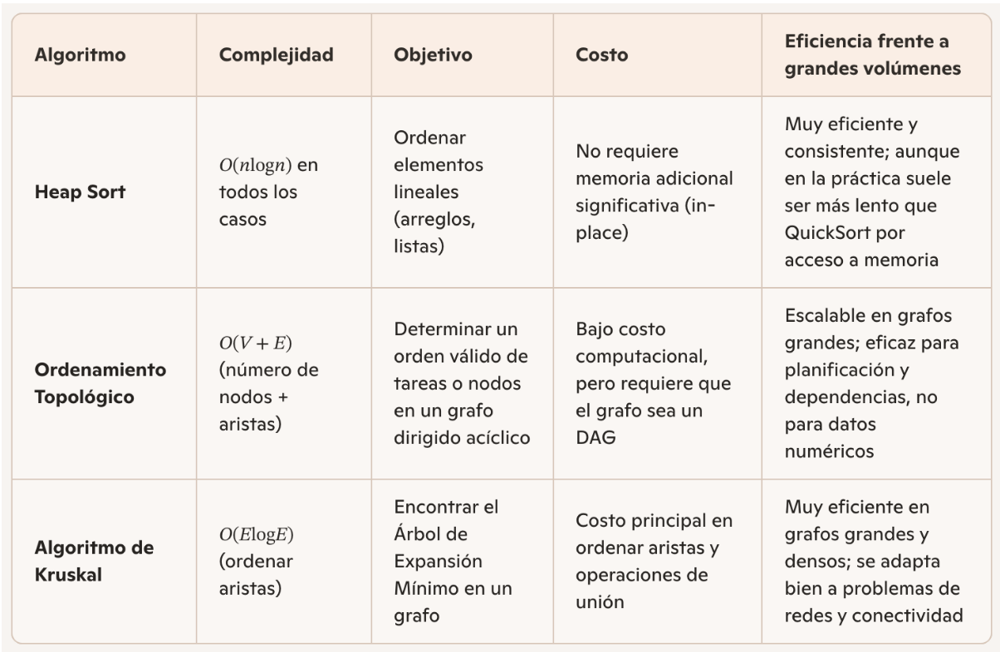

a) Un montículo binario (binary heap) es una estructura de datos muy utilizada en contextos profesionales donde se requiere manejar eficientemente prioridades o realizar operaciones rápidas de inserción y extracción del elemento más relevante. El heap mínimo sirve para acceder rápidamente al elemento más pequeño, mientras que el heap máximo facilita el acceso al más grande; ambos se apoyan en la misma estructura binaria, pero con distinta condición de orden.
Para que sea un montículo válido, debe ser un árbol binario completo: todos sus niveles han de estar llenos, a excepción, posiblemente, del último, que se completa de izquierda a derecha.

Un montículo binario encuentra aplicación en diversos contextos profesionales:

Colas de prioridad. Es su uso más extendido. Los sistemas operativos recurren a ellas para la planificación de procesos, asignando tiempo de CPU según la prioridad de cada tarea. También aparecen en simulaciones de eventos discretos, donde cada evento tiene un tiempo de ocurrencia y debe procesarse en orden cronológico.
Algoritmos de grafos. El algoritmo de Dijkstra, utilizado para encontrar el camino más corto en redes, emplea una cola de prioridad basada en un heap para seleccionar eficientemente el nodo no visitado de menor costo acumulado. De manera similar, el algoritmo de Prim para árboles de expansión mínima se apoya en la misma estructura. En inteligencia artificial y videojuegos, el algoritmo A* sigue el mismo principio: seleccionar en cada paso el nodo con menor costo estimado.
Heap sort. Es un algoritmo de ordenamiento que aprovecha las propiedades del montículo para ordenar elementos en tiempo O(n log n) en el peor caso, con la ventaja adicional de operar en memoria constante, lo que lo hace atractivo en entornos con recursos limitados.
Gestión de memoria y sistemas de tiempo real. En aplicaciones donde las respuestas deben producirse dentro de plazos estrictos, el heap permite determinar en tiempo constante cuál es la tarea más urgente pendiente.
Codificación de Huffman. La construcción del árbol de Huffman, utilizado en compresión de datos, requiere extraer repetidamente los dos elementos de menor frecuencia, tarea para la cual un heap mínimo resulta ideal.

Cabe mencionar también el montículo de Fibonacci, que no es una aplicación del heap binario sino una estructura relacionada e independiente, funciona mejorando la complejidad amortizada de ciertas operaciones y se emplea principalmente en implementaciones avanzadas del algoritmo de Dijkstra y en optimización de redes, donde la cantidad de operaciones de disminución de clave es significativamente mayor que las extracciones.

Un montículo binario constituye una herramienta fundamental en el diseño de sistemas eficientes: su capacidad para mantener el elemento más relevante siempre accesible en tiempo constante lo convierte en la base de soluciones en campos tan diversos como los sistemas operativos, las telecomunicaciones, las finanzas, la inteligencia artificial y las bases de datos.

b) Para implementar un Heap Sort aplicado a un inventario de minirmercado, trabajaremos con productos que tienen una clave de comparación (por ejemplo, el stock disponible)
En este caso contamos con un conjunto inicial de productos y su respectivo  stock, donde la clave de ordenamiento se implementa tomando el valor del stock como criterio de comparación. Al haber elegido stock como clave, el heap se construye y reorganiza comparando únicamente ese valor.
(VER CÓDIGO)

c) Se le solicitó a la IA Copilot que genere una tabla comparativa de Heap Sort con los algoritmos de ordenamiento topológico y Kruskal. Se especificó que las columnas contengan información sobre: complejidad, objetivo, costo, y eficiencia frente a grandes volúmenes de datos. 
La tabla generada fue la siguiente:

Del material de estudio sabemos que:
La idea central de Heap Sort consiste en construir un heap a partir de un arreglo de elementos y luego extraer repetidamente el elemento máximo (en un max-heap) o el mínimo (en un min-heap), y que no requiere memoria adicional significativa.
En cuanto al ordenamiento topológico, el material de estudio especifica que esta ordenación lineal se aplica a teoría de grafos específicamente y su objetivo es organizar los nodos de modo que, para cada arista dirigida de un nodo u a un nodo v, u aparezca antes que v en la ordenación.
Kruskal se implementa dentro del contexto de los árboles de expansión mínima (MST), este algoritmo requiere un paso previo de ordenar todas las aristas del grafo por peso de menor a mayor antes de comenzar a integrarlas a la solución.

Con lo expuesto de ambas fuentes, se puede concluir que cada algoritmo es “eficaz” en su propio dominio: Heap Sort en colecciones lineales, Orden Topológico en dependencias de grafos, y Kruskal en optimización de conexiones.
Heap Sort logrará ordenar datos numéricos o registros y resulta útil cuando se requiere rendimiento garantizado sin depender de la distribución.
El ordenamiento Topológico se adecúa mejor a la planificación de tareas con dependencias, compiladores (orden de módulos), sistemas de precedencia.
Mientras que el algoritmo de Kruskal es indicado para problemas de redes de telecomunicaciones, diseño de circuitos, optimización de rutas y costos.
