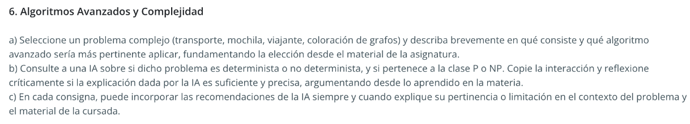

a) El problema de la mochila consiste en seleccionar un subconjunto de objetos (cada uno con un peso y un valor asociados) para introducirlos en una mochila con una capacidad máxima determinada. El objetivo central es maximizar el valor total de los objetos elegidos sin exceder dicho límite de peso.
De acuerdo con el material de la asignatura, el enfoque avanzado más pertinente para resolver este problema es el paradigma algorítmico de la programación dinámica.
Para la variante conocida como Mochila 0-1, donde cada objeto se toma por completo o se descarta, la programación dinámica aborda el problema dividiéndolo en subproblemas más simples, resolviendo cada uno una sola vez y almacenando los resultados para evitar cálculos repetidos, lo cual constituye la técnica conocida como memoización. Con este fin, se construye una tabla en la que cada celda representa la mejor solución posible para un subconjunto de objetos y una capacidad parcial de la mochila. Al completar dicha tabla de manera sistemática, el valor óptimo queda almacenado en su última celda.
Cabe señalar que el problema de la mochila pertenece a la clase de problemas NP-completos, lo que implica que no se conoce ningún algoritmo que lo resuelva de forma exacta en tiempo polinomial para el caso general. En consecuencia, si bien la programación dinámica es efectiva para instancias de tamaño manejable, ante casos de gran escala, donde el tiempo de cómputo se vuelve prohibitivo, resulta válido recurrir a algoritmos de aproximación, capaces de obtener soluciones cercanas al óptimo en un tiempo razonable.
En definitiva, la programación dinámica se destaca por su capacidad de garantizar la solución óptima mediante un enfoque estructurado de exploración y almacenamiento de subsoluciones, consolidándose como una herramienta central del Módulo 6 para abordar problemas de optimización combinatoria.

b) Respuesta de IA Claude: 
El problema de la mochila es un problema no determinista en el sentido de que no existe un algoritmo de tiempo polinomial conocido que lo resuelva de manera exacta para el caso general. Pertenece a la clase NP, lo que significa que, dado un conjunto de objetos seleccionados como solución candidata, es posible verificar en tiempo polinomial si dicha solución es válida y óptima. En su versión de decisión —es decir, "¿existe una selección de objetos con valor mayor o igual a k sin superar la capacidad?"— el problema es NP-completo, ya que es tan difícil como cualquier otro problema en NP y se puede reducir polinomialmente desde otros problemas NP-completos conocidos.

c) La respuesta de la IA contiene elementos correctos pero también presenta imprecisiones conceptuales relevantes que vale la pena señalar.
En primer lugar, la IA confunde los conceptos de determinismo y pertenencia a una clase de complejidad. Que un problema sea "no determinista" no significa que no tenga algoritmos deterministas que lo resuelvan: la programación dinámica es precisamente un algoritmo determinista que resuelve el problema de la mochila de manera exacta. La distinción determinista/no determinista refiere al modelo de máquina utilizado: máquina de Turing determinista (MTD) versus máquina de Turing no determinista (MTND)—, no a una propiedad intrínseca del problema en sí.
En segundo lugar, la afirmación de que es posible verificar en tiempo polinomial si una solución es "válida y óptima" es incorrecta. La verificación en tiempo polinomial que define a NP se aplica únicamente a la validez de una solución candidata (comprobar que el peso no se excede y que el valor supera el umbral k), pero no a su optimalidad. Verificar que una solución es la mejor posible requeriría comparar con todas las demás soluciones posibles.
En tercer lugar, la respuesta es imprecisa respecto de la versión del problema. Como se estudia en el módulo, el problema de la mochila tiene una versión de optimización de maximizar el valor y una versión de decisión para determinar si existe una selección que supere un valor k. Solo la versión de decisión puede clasificarse formalmente como NP completo, puesto que las clases P y NP se definen sobre problemas de decisión. La IA no lo establece con claridad de esta forma.
En conclusión, la explicación de la IA es parcialmente útil como punto de partida, pero resulta insuficiente y en aspectos clave, imprecisa. Desde lo aprendido en la materia, la respuesta correcta y completa debería precisar que el problema de la mochila admite algoritmos deterministas exactos como la programación dinámica, lo que lo hace tratable en la práctica para valores de capacidad acotados; y que es su versión de decisión la que se clasifica formalmente como NP-completo, al poder reducirse polinomialmente desde problemas como Subset Sum.
